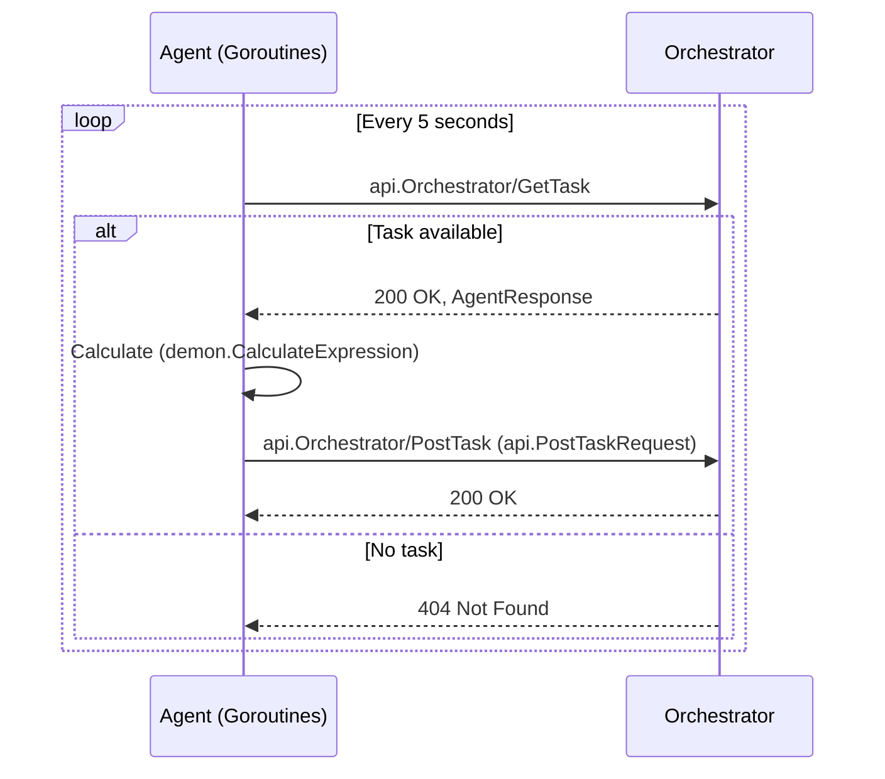
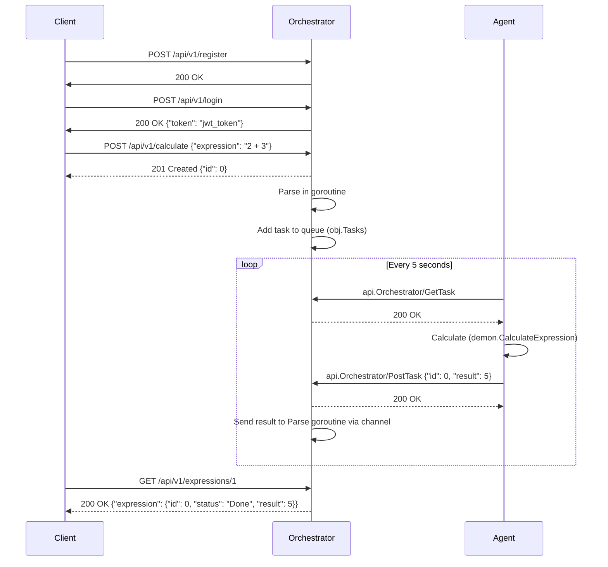

# Calculator API

## Описание
**Calculator API** — это распределенное веб-приложение, предоставляющее возможность вычислять математические выражения через HTTP-запросы. Приложение состоит из двух основных компонентов: оркестратора и агента. Оркестратор принимает запросы от клиента, распределяет задачи агентам и возвращает результаты вычислений. Агенты выполняют вычисления и отправляют результаты оркестратору. 

## Важно
**Время ожидания результата** в среднем от 5 до 30 секунд из-за обновления базы данных по таймеру раз в 15 секунд. Это сделано для стабильности работы приложения при высокой нагрузке. Высокая нагрузка на базу данных может создать сложности в работе приложения. Для устранения проблемы в следующих версиях рекомендуется увеличить количество коннектов к базе данных и сделать репликации для аварийной работы программы при сбоях в основной версии базы данных.


## Структура проекта
````
sprint5Final/
├── agent/                          # Директория для кода агента
│   ├── cmd/                        # Точка входа для агента
│   │   └── main.go                 # Основной файл для запуска агента
│   ├── internal/                   # Внутренние пакеты агента
│   │   ├── client/                 # Логика клиента агента
│   │   │   ├── client.go           # Реализация клиента для взаимодействия с оркестратором
│   │   │   └── client_test.go      # Юнит-тесты для пакета client
│   │   └── demon/                  # Логика вычислений агента
│   │       ├── demon.go            # Реализация логики вычисления выражений
│   │       └── demon_test.go       # Юнит-тесты для пакета demon
│   ├── entities/                   # Определения общих структур данных агента
│   │    ├── agent_request.go        # Определение структур запросов агента
│   │    └── agent_response.go       # Определение структур ответов агента
│   └── go.mod                      # Файл Go-модуля для управления зависимостями (agent)
├── orchestrator/                   # Каталог для кода оркестратора
│   ├── api/                        # Файлы протоколов gRPC
│   │   ├── orchestrator.proto      # Описание gRPC сервиса
│   │   └── orchestrator_grpc.pb.go # Сгенерированный код gRPC
│   ├── cmd/                        # Точка входа для оркестратора
│   │   └── main.go                 # Основной файл для запуска оркестратора
│   ├── internal/                   # Внутренние пакеты оркестратора
│   │   ├── entities/               # Определения общих структур данных оркестратора
│   │   │   ├── globals.go          # Глобальные переменные и общее состояние
│   │   │   ├── orchestrator_request.go  # Определение структур запросов оркестратора
│   │   │   ├── orchestrator_response.go # Определение структур ответов оркестратора
│   │   │   └── task.go             # Определение структуры задачи
│   │   ├── parser/                 # Логика парсинга выражений
│   │   │   ├── parser.go           # Реализация парсинга выражений в обратную польскую нотацию
│   │   │   └── parser_test.go      # Юнит-тесты для пакета parser
│   │   └── server/                 # Логика сервера оркестратора
│   │       ├── server.go           # Реализация сервера для обработки запросов
│   │       └── server_test.go      # Юнит-тесты для пакета server
│   └── go.mod                      # Файл Go-модуля для управления зависимостями (orchestrator)
├── pkg/                            # Общий пакет с утилитами
│   ├── logger/                     # Пакет для логирования
│   │   └── logger.go               # Реализация логгера         
│   ├── counter.go                  # Реализация потокобезопасного счётчика
│   ├── map.go                      # Реализация потокобезопасной карты (SafeMap)
│   ├── queue.go                    # Реализация потокобезопасной очереди
│   └── redBlackTree.go             # Реализация красно-чёрного дерева
├── grpc_server/                    # Код gRPC сервера
│   └── server.go                   # Реализация gRPC сервера
├── parser/                         # Логика парсинга выражений
│   ├── parser.go                   # Реализация парсинга выражений
│   └── parser_test.go              # Юнит-тесты для пакета parser
├── server/                         # Логика сервера оркестратора
│   ├── server.go                   # Реализация сервера
│   └── server_test.go              # Юнит-тесты для пакета server
├── logger/                         # Пакет для логирования
│   └── logger.go                   # Реализация логгера
├── go.mod                          # Файл Go-модуля для управления зависимостями
├── Makefile                        # Файл для автоматизации сборки и генерации кода
├── docker-compose.yml              # Конфигурация Docker Compose для запуска проекта
├── Dockerfile                      # Dockerfile для сборки проекта
└── go.work                         # Файл Go workspace для управления несколькими модулями
````

## Инструкция по запуску

Проект можно запустить с помощью Docker и Docker Compose. Оркестратор и агент собираются в отдельные Docker-образы, которые затем запускаются как сервисы через `docker-compose`.

### Требования

- Установленный [Docker](https://docs.docker.com/get-docker/).
- Установленный [Docker Compose](https://docs.docker.com/compose/install/).
- Убедитесь, что у вас есть доступ к порту `8080 и 8081` (используются оркестратором).

### Шаги для запуска

1. **Склонируйте репозиторий**:
   ```bash
   git clone <repository-url>
   cd sprint5Final
    ```
2. Настройте переменные окружения:
   - Откройте файл docker-compose.yml и замените значения переменных окружения для сервисов agent и orchestrator:

```bash
services:
  agent:
    image: agent-app
    build:
      context: .
      target: agent
    environment:
      - COMPUTING_POWER=10

  orchestrator:
    image: orchestrator-app
    build:
      context: .
      target: orchestrator
    ports:
      - "8080:8080"
      - "8081:8081"
    environment:
      - TIME_ADDITION_MS=100
      - TIME_SUBTRACTION_MS=100
      - TIME_MULTIPLICATIONS_MS=100
      - TIME_DIVISIONS_MS=100
      - COMPUTING_POWER=10
```

3. Соберите и запустите проект:
   - Выполните команду для сборки и запуска контейнеров:
        ```bash
        docker-compose up --build
        ```
     - Эта команда:
       - Соберёт Docker-образы agent-app и orchestrator-app с использованием Dockerfile.
       - Запустит два сервиса: agent и orchestrator.
       - Откроет порт 8080 и 8081 для доступа к API оркестратора.
4. Проверьте запуск:
   - Убедитесь, что оркестратор доступен по адресу http://localhost:8080.
   - Вы можете отправить тестовый запрос для регистрации:
   ```bash
   curl X POST http://localhost:8080/api/v1/register -H "Content-Type: application/json" -d '{"login": "fedoriny", "password": "fedorinypass"}'
   ```
   - Ожидаемый ответ: Статус код 200
5. Остановите контейнеры:
    - Для остановки контейнеров выполните `Ctrl+C`.
    - Для полного удаления контейнеров выполните:
      ```bash
      docker-compose down
      ```

## Agent
Директория agent содержит код агента, который получает посредством gRPC выражения для вычисления и отправляет результаты вычислений оркестратору. Агент состоит из следующих пакетов:
- cmd: точка входа для агента
- internal/client: логика клиента агента
- internal/demon: логика вычислений агента
- entities: определения общих структур данных агента
- go.mod: файл Go-модуля для управления зависимостями

### Процесс работы агента:
1. **Запуск агента**:
    - При старте агент считывает переменную окружения `COMPUTING_POWER`, которая определяет количество горутин (вычислителей), запускаемых для параллельной обработки задач.
    - Если `COMPUTING_POWER` не указана или некорректна (меньше или равна 0), используется значение по умолчанию (например, 1).
    - Агент запускает указанное количество горутин, каждая из которых выступает в роли независимого вычислителя.

2. **Запрос задач у оркестратора**:
    - Агент периодически отправляет gRPC-запросы к оркестратору основываясь на контракте описанном в `orchestrator.proto`, чтобы запросить задачу для обработки.
    - Запросы выполняются с использованием тикера (например, каждые 5 секунд), чтобы агент постоянно "спрашивал" у оркестратора: "Дай задачку поработать".

3. **Получение задачи**:
    - Оркестратор возвращает задачу в структуре `api.GetTaskResponse`, которая содержит:
        - Идентификатор задачи (`Id`).
        - Аргументы выражения (`Arg1`, `Arg2`).
        - Операцию (`Operation`, например, `+`, `-`, `*`, `/`).
        - Время выполнения операции (`OperationTime`).
    - Если задач нет, оркестратор возвращает статус `404 Not Found`, и агент продолжает запрашивать задачи.

4. **Обработка задачи**:
    - Агент передаёт полученную задачу одной из горутин-вычислителей через канал (`taskChan`).
    - Каждая горутина вызывает функцию `demon.CalculateExpression` для вычисления выражения:
        - Функция принимает аргументы (`Arg1`, `Arg2`), операцию (`Operation`) и время выполнения (`OperationTime`).
        - Выполняется вычисление (например, `Arg1 + Arg2` для операции `+`).
        - Функция имитирует задержку выполнения с помощью `time.Sleep` на указанное время `OperationTime`.
        - Если операция некорректна, возвращается ошибка (например, "wrong operator").

5. **Отправка результата**:
    - После вычисления горутина формирует результат в структуре `api.PostTaskRequest` (содержит `Id` задачи и `Result` вычисления).
    - Агент отправляет результат оркестратору через gRPC-запрос.
    - Если запрос успешен (статус `200 OK`), задача считается завершённой. В противном случае агент логирует ошибку и продолжает работу.

#### API взаимодействия агента с оркестратором

##### 1. Получение задачи для выполнения

Агент отправляет gRPC-запрос к оркестратору, чтобы получить задачу для обработки.

**Запрос**:

```bash
grpcurl localhost:8081 api.Orchestrator/GetTask
```
Коды ответа:

- 200 OK: Успешно получена задача.
- 404 Not Found: Нет доступных задач.
- 500 Internal Server Error: Произошла ошибка на стороне сервера.

Тело ответа (при статусе 200):

```json
{
    "task": {
        "id": 1,
        "arg1": 2.0,
        "arg2": 3.0,
        "operation": "+",
        "operation_time": 100
    }
}
```

- id: Идентификатор задачи.
- arg1: Первый аргумент выражения.
- arg2: Второй аргумент выражения.
- operation: Операция для выполнения (+, -, *, /).
- operation_time: Время выполнения операции в миллисекундах.

##### 2. Приём результата обработки данных
   Агент отправляет gRPC-запрос к оркестратору, чтобы передать результат вычисления.

Запрос:

```bash
grpcurl -plaintext -d `{"id": "1", "result": "5"}` localhost:8081 api.Orchestrator/PostTask
```

Коды ответа:

- 200 OK: Результат успешно записан.
- 404 Not Found: Задача с указанным id не найдена.
- 422 Unprocessable Entity: Переданы невалидные данные (например, некорректный формат JSON).
- 500 Internal Server Error: Произошла ошибка на стороне сервера.

Тело ответа:

Ответ не содержит тела (пустой ответ).

#### Схема взаимодесйтвия агента с оркестратором:



## Orchestrator
Директория orchestrator содержит код оркестратора, который принимает HTTP-запросы от агентов и клиента для управления задачами и вычислениями. Оркестратор состоит из следующих пакетов:
- cmd: точка входа для оркестратора
- internal/entities: определения общих структур данных оркестратора
- internal/grpc_server: логика grpc-сервера оркестратора для взаимодействия с агентом
- internal/parser: логика парсинга выражений
- internal/server: логика http-сервера оркестратора для взаимодействия с клиентом
- go.mod: файл Go-модуля для управления зависимостями

### Процесс работы оркестратора:
Оркестратор — это серверное приложение, которое управляет вычислением арифметических выражений, взаимодействуя с клиентом и агентом. Клиент отправляет запросы на вычисление выражений через HTTP API, а оркестратор распределяет задачи агентам, которые выполняют вычисления. После получения результата от агента оркестратор возвращает результат клиенту.

#### Взаимодействие с клиентом

Оркестратор предоставляет HTTP API для взаимодействия с клиентом. Доступны следующие эндпоинты:

##### 1. Добавление вычисления арифметического выражения

Клиент отправляет запрос на вычисление арифметического выражения.

**Запрос**:

```bash
curl --location 'localhost/api/v1/calculate' \
--header 'Content-Type: application/json' \
--data '{
  "expression": "2 + 3"
}'
```

Коды ответа:

- 201 Created: Выражение принято для вычисления.
- 422 Unprocessable Entity: Невалидные данные (например, некорректное выражение).
- 500 Internal Server Error: Произошла ошибка на стороне сервера.

Тело ответа:
```json
{
   "id": 1
}
```
##### 2. Получение списка выражений
   Клиент запрашивает список всех выражений и их статусов.

Запрос:
```bash
curl --location 'localhost/api/v1/expressions'
```

Коды ответа:

- 200 OK: Успешно получен список выражений.
- 500 Internal Server Error: Произошла ошибка на стороне сервера.

Тело ответа:
```json
{
    "expressions": [
        {
            "id": 1,
            "status": "Done",
            "result": 5
        },
        {
            "id": 2,
            "status": "In progress"
        },
       {
            "id": 3,
            "status": "Fail",
            "error": "division by zero"
       }
    ]
}
```

- id: Идентификатор выражения.
- status: Статус вычисления (In progress, Done, Fail).
- result: Результат выражения (0.0, если вычисление не завершено).
- error: Ошибка вычисления (например, "division by zero").

##### 3. Получение выражения по идентификатору
   Клиент запрашивает информацию о конкретном выражении по его идентификатору.
   
Запрос:
```bash
curl --location 'localhost/api/v1/expressions/1'
```

Коды ответа:

- 200 OK: Успешно получено выражение.
- 404 Not Found: Выражение с указанным id не найдено.
- 500 Internal Server Error: Произошла ошибка на стороне сервера.

Тело ответа:
```json
{
    "id": 1,
    "status": "Done",
    "result": 5
}
```

- id: Идентификатор выражения.
- status: Статус вычисления (In progress, Done, Fail).
- result: Результат выражения (0.0, если вычисление не завершено).
- error: Ошибка вычисления (например, "division by zero").

### Взаимодействие с агентом
Оркестратор взаимодействует с агентом через HTTP API, распределяя задачи и принимая результаты вычислений. Подробности взаимодействия описаны в Схеме работы агента.

#### Краткий процесс:
1. Агент запрашивает задачу через gRPC-запрос.
2. Оркестратор возвращает задачу из очереди (если она есть) или статус 404.
3. Агент выполняет вычисление и отправляет результат через gRPC-запрос.
4. Оркестратор принимает результат и передаёт его соответствующей горутине Parse.

#### Реализация взаимодействия

##### 1. Регистрация клиента
- Клиент отправляет запрос на регистрацию через POST /api/v1/register
- Оркестратор проверяет существует ли такой пользователь:
  - Если существует, возвращает 500 Internal Server Error
- Для несуществующего пользователя оркестартор создает профиль в базе данных с уникальным id, логином и паролем
- Оркестратор возвращает клиенту 200 OK

##### 2. Вход клиента
- Клиент отправляет запрос на вход через POST /api/v1/login
- Оркестратор проверяет есть ли такой пользователь:
  - Если пользователь не найден в базе данных, 500 Internal Server Error

##### 3. Обработка запроса от клиента
   - Клиент отправляет запрос на вычисление выражения через POST /api/v1/calculate.
   - Оркестратор проверяет валидность jwt-токена в заголовке
     - Если токен не валиден, возвращает 401 Unauthorized
     - Если валиден, пропускает запрос и прокидывает user_id пользователя через контекст
   - Оркестратор проверяет валидность выражения:
     - Если выражение невалидно, возвращается 422 Unprocessable Entity.
   - Для валидного выражения оркестратор генерирует уникальный идентификатор (id), возвращает его клиенту (201 Created) и запускает парсинг в горутине:
     - Функция Parse парсит выражение в обратную польскую нотацию.
     - Формирует задачи для вычисления (например, разбивает выражение на подзадачи).
     - Кладёт задачи в общую очередь (obj.Tasks).
     - Создаёт канал для получения результата и ждёт ответа от агента.

##### 4. Распределение задач агентам
   - Агент периодически запрашивает задачи через gRPC-запросы.
   - Оркестратор проверяет очередь задач:
     - Если очередь пуста, возвращается 404 Not Found.
     - Если задача есть, оркестратор извлекает её из очереди (obj.Tasks.Dequeue()) и отправляет агенту (200 OK).

##### 5. Получение результата от агента
   - Агент выполняет вычисление и отправляет результат через gRPC-запрос.
   - Оркестратор находит соответствующий канал (obj.ParsersTree.Search(id)), связанный с задачей:
      - Если канал не найден, возвращается 404 Not Found.
      - Если канал найден, оркестратор отправляет результат в канал (*ch <- result) и возвращает 200 OK.

#### 6. Завершение обработки
   - Горутина Parse, ожидавшая результата в канале, получает его и продолжает парсинг.
   - После завершения всех вычислений результат сохраняется в obj.Expressions с соответствующим статусом (Done или Fail).
   - Раз в 15 секунд функция startUpdatingDB обновляет базу данных новыми посчитанными выражениями из кэша obj.Expressions, и очищает записанные туда выражения, которые были посчитаны
   - Клиент может запросить результат через GET /api/v1/expressions/:id.

#### Схема взаимодействия оркестратора с агентом:



## Тестирование
Для запуска тестов перейдите в соответствующую директорию и выполните команду `go test ./...`. Например:
```bash
cd orchestrator
go test ./...
```
Таким образом, будут запущены все тесты внутри пакета orchestrator.

## Примеры использования
### Пример 1: Вычисление выражения
1. Отправьте POST-запрос для регистрации:
```bash
curl X POST http://localhost:8080/api/v1/register -H "Content-Type: application/json" -d '{"login": "fedoriny", "password": "fedorinypass"}'
```
2. Ожидаемый ответ:
Статус код 200
3. Отправьте POST-запрос для входа в профиль:
```bash
curl -X POST http://localhost:8080/api/v1/login -H "Content-Type: application/json" -d '{"login": "fedoriny", "password": "fedorinypass"}'
```
4. Ожидаемый ответ:
```json
{
    "token": "jwt_token"
}
```
5. Отправьте POST-запрос для вычисления выражения:
```bash
curl -X POST http://localhost:8080/api/v1/calculate -H "Authorization: Bearer jwt_token" -H "Content-Type: application/json" -d '{"expression":"2*8-9"}'
```

6. Ожидаемый ответ:
```json
{
    "id": 0
}
```
7. Запросите результат:
```bash
curl -X GET http://localhost:8080/api/v1/expressions/0 -H "Authorization: Bearer jwt_token"
```
8. Ожидаемый ответ:
```json
{
    "id": 0,
    "status": "Done",
    "result": 9
}
```
9. Если вы запросите результат сразу после отправки выражения, вы получите статус "In progress":
```json
{
    "id": 0,
    "status": "In progress"
}
```
10. Запрос всех выражений:
```bash
curl -X GET http://localhost:8080/api/v1/expressions -H "Authorization: Bearer jwt_token"
```
11. Ожидаемый ответ:
```json
{
    "expressions": [
        {
            "id": 0,
            "status": "Done",
            "result": 9
        }
    ]
}
```